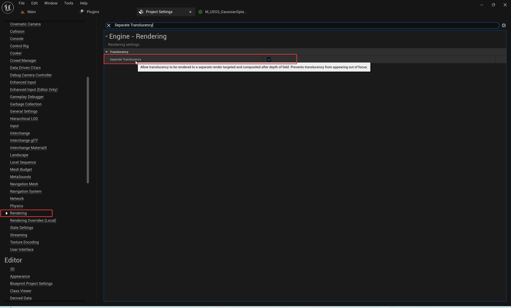

# Notes

**Note01:** There is a bug with the github DownloadZIP(".map" asset files are Git LFS files, Github DownloadZIP results in the ".map" file only 1KB).  **You should clone this repository by HTTPs or SSH of this git, Not by Github DownloadZIP.**


**Note02**: The "**UEGS Model**" is not visible in your project? [This is because the material compiling did not succeed, need to recompile the following material.](https://github.com/YHK-UEPlugins-Public/018_UEGaussianSplatting_Public#this-is-because-the-material-compiling-did-not-succeed-need-to-recompile-the-following-material-1)

> /Script/Engine.Material'/UEGaussianSplatting/ASTs/MATs/M_UEGS_GaussianSplatting_Main_Translucent.M_UEGS_GaussianSplatting_Main_Translucent'

**Notice**: This issue is **fixed** in the Version **v1.1.2** of this plugin.
**See more**: https://github.com/YHK-UEPlugins-Public/018_UEGaussianSplatting_Public#1-the-uegs-model-is-not-visible


**Note03**: Any "**Package Project**" issues can  refer to this document section: "**Package Project" issues**"-> https://github.com/YHK-UEPlugins-Public/018_UEGaussianSplatting_Public#4-package-project-issues


# Community Communication

**Add Discord.com Friend**: **YeHaike**

**DemoVideo**:

- **YouTube**: https://youtu.be/4xTEyz9bx5E

**Get this Plugin from UE Marketplace:** https://www.unrealengine.com/marketplace/en-US/product/uegaussiansplatting-3d-gaussian-splatting-rendering-feature-for-ue

# Updated versions

## v1.1.0

> Supports the ".ply" file exported by the 3DGaussianSplatting Editor "**SuperSplat**"
>
> **"SuperSplat" Editor**: https://playcanvas.com/super-splat
>
> **See more**: https://github.com/YHK-UEPlugins-Public/018_UEGaussianSplatting_Public#editing-the-ply-file-of-3dgaussiansplatting

## **v1.1.1:** Submission time(2023-11-11 23:00)

- Optimized performance for transparent points sorting.
- Improved frame rates for a smoother experience.

## **v1.1.2:** Submission time(2023-11-16 23:30)

- Optimized performance for transparent points sorting.

- Improved frame rates for a smoother experience.

- Fixed "Package Project" Issues. Fixed Packaged Materials not visible(Compiling Issue).  **See more**: "**Package Project" issues**"-> https://github.com/YHK-UEPlugins-Public/018_UEGaussianSplatting_Public#4-package-project-issues

- Updated:  "Masked" type material supporting. Avoid frame rate fluctuations when rotating a certain viewing angle caused by translucent particle sorting. **See more**: https://shorturl.at/fCNX2

  

# Introduce

## PRODUCT TITLE：

**UEGaussianSplatting: 3D Gaussian Splatting Rendering Feature For UE**

**UE Marketplace:** https://www.unrealengine.com/marketplace/en-US/product/uegaussiansplatting-3d-gaussian-splatting-rendering-feature-for-ue


## SHORT DESCRIPTION：

A high-performance and high-quality 3D Gaussian Splatting real-time rendering plugin for Unreal Engine, Optimized for spatial point data.

## LONG DESCRIPTION：

**DemoVideo**:

- **YouTube**: https://youtu.be/4xTEyz9bx5E

**Documentation and Example Project:** https://github.com/YHK-UEPlugins-Public/018_UEGaussianSplatting_Public

UEGaussianSplatting is a powerful plugin for Unreal Engine that brings real-time rendering of 3D Gaussian Splatting model resources with high performance and high quality. 

It utilizes octree optimization for spatial point data, dynamic LOD rendering, and supports automatic collision generation. 

This plugin also offers very fast ".ply" resource importing and GaussianSplatting Asset editing preview window. 

UEGaussianSplatting uses a completely custom rendering component instead of the traditional particle system (Niagara), allowing it to bypass particle count limitations. 

Future updates will include real-time clipping and editing of GaussianSplatting asset data, as well as export functionality.

## TECHNICAL INFORMATION：

### Features: 

- Features:
  - High-performance and high-quality 3D Gaussian Splatting real-time rendering.
  - Octree optimization for spatial point data.
  - Dynamic LOD rendering.
  - Automatic collision generation.
  - Support for ".ply" resource quick import.
  - GaussianSplatting Asset editing preview window.
  - Custom rendering component, not limited by particle count.

### Code Modules: 

- **UEGaussianSplatting**(Runtime)
- **UEGaussianSplattingEditor**(Editor)

**Number of C++ Classes:** 30.
**Supported Development Platforms:** Windows, Mac and Linux.

**Supported All Target Build Platforms, such as:** Win64, Mac, Linux.

**Documentation and Example Project:** 
https://github.com/YHK-UEPlugins-Public/018_UEGaussianSplatting_Public

**Advantages:**

- High-quality real-time rendering of complex 3D Gaussian Splatting models.
- Efficient use of resources with octree optimization and dynamic LOD rendering.
- Easy integration with existing Unreal Engine projects.
- No particle count limitations, allowing for more complex scenes.

**Improvement Plan:**

1. Implement real-time clipping and editing of GaussianSplatting Asset data.
2. Add export functionality for edited GaussianSplatting Assets.
3. Continuously improve performance and optimize resource usage.
4. Regularly update the plugin to ensure compatibility with the latest Unreal Engine releases.


# User Guide

## What is "3D Gaussian Splatting"?

### Paper: "3D Gaussian Splatting for Real-Time Radiance Field Rendering" 

https://repo-sam.inria.fr/fungraph/3d-gaussian-splatting/


### Youtube: "3D Gaussian Splatting: How's This The Future of 3D AI?"

https://www.youtube.com/watch?v=C708Mh7EHZM


### "3D Gaussian Splatting" Resource Platform: "**poly.cam**"

https://poly.cam/explore?feed=splat


## How to use this Example Project: "[ExampleProjects/UEGSDemo](https://github.com/YHK-UEPlugins-Public/018_UEGaussianSplatting_Public/tree/main)"?

### 1. Get this "**UEGaussianSplatting**" plugin from UnrealEngine Marketplace:

https://www.unrealengine.com/marketplace/en-US/product/uegaussiansplatting-3d-gaussian-splatting-rendering-feature-for-ue


### 2. Clone this Example Project from: https://github.com/YHK-UEPlugins-Public/018_UEGaussianSplatting_Public

**Note**: Need to use the Git clone method, not the zip download method (which can be problematic due to LFS files).


### 3. Copy the "**UEGS**" plugin  from UnrealEngine Install Path to the "Plugins" folder of this Example Project.

Copy the "**UEGS**" plugin of UnrealEngine Install Path:


Copy it to the "**Plugins**" folder of this Example Project:


### 4. Make sure the "`UEGSDemo.uproject`" is associated with the correct engine version. And click the "**`UEGSDemo.uproject`**" to open this Example Project.

"`.\ExampleProjects\UEGSDemo\UEGSDemo.uproject`":


### 5. Find and open the Example Maps:

/Script/Engine.World'/Game/UEGSDemo/MAPs/MAP_UEGSDemo_Overview_01.MAP_UEGSDemo_Overview_01'


**Note**: Since the "**3D Gaussian Splatting**"(Or named "**UEGS Model**" in this "UEGaussianSplatting" Plugin) file is relatively large, and the storage space of Git repository on GitHub is limited. So only these 4 "3D Gaussian Splatting" sample files and levels are uploaded at present.

### 6. If the The "UEGS Model" is not visible, should recompile the following material:

### This is because the material compiling did not succeed, need to recompile the following material. **NOTE**: This issue is **fixed** in the Version 1.1.2 of this plugin.

`/Script/Engine.Material'/UEGaussianSplatting/ASTs/MATs/M_UEGS_GaussianSplatting_Main_Translucent.M_UEGS_GaussianSplatting_Main_Translucent'`


1. Open the "**`M_UEGS_GaussianSplatting_Main_Translucent`**" Material and move a node to make the "**Apply**" button clickable. 
2. And Click the "**Apply**" button(**Note**: do not click the "**Save**" button until the Shader Compiling finished), this will recompile this Material. 
3. After the Shader compilation of this material has been all completed, click the "**Save**" button to save this material.


### 7. For other issues, please refer to the "**Issues Fixing**" chapter below.


## Get new "3D Gaussian Splatting" resources from "[poly.cam](https://poly.cam/explore?feed=splat)" and import into our UE Example Project

### 1. Open one "3D Gaussian Splatting" resource in the "[poly.cam](https://poly.cam/explore?feed=splat)", and click the "Save Capture" Button. Save it to our own Album(Note: advance registration and login required).

https://poly.cam/capture/9badeef6-8005-4324-9979-1260adc8dba5


### 2. Open the "3D Gaussian Splatting " resource from the corresponding Album. Click the "Download" button to download it as a ".ply" file.

https://poly.cam/albums


### 3. Drag the "**.ply**" file into the "Content Browser" of the UE Example Project(With "**UEGaussianSplatting**" plugin Enabled.)


## Editing the ".ply" File of "3DGaussianSplatting" 

### Method 01: Use the Online Editing Tool "SuperSplat" to edit the ".ply" file of "3DGaussianSplatting" 

**Test File**: https://poly.cam/capture/ba00df8c-5295-4314-b17a-f6227259179b

Get more from: https://poly.cam/explore?feed=splat


**“SuperSplat” Online Editing Tool**: https://playcanvas.com/super-splat


After exporting the ".ply" file, **drag** the exported "**.ply**" file into the **ContentBrowser** of UnrealEngine Project(Ensure that the "**UEGaussianSplatting**" plugin is enabled) :


## "UEGS" Plugin Instructions

### 1. Clipping Volume: Clip the excess parts of the UEGS model

#### Method01: Use the "AUEGaussianSplattingClippingVolume" Volume to Clip the UEGS Model Points(Clipping in this way is achieved by hiding transparent particles, so there is no change in performance)

##### Sample01

Before Clipping:


After Clipping:


##### Sample02

Before Clipping:


After Clipping:


### 2. "Build Collision" for "UEGS Asset"

Build Collision:


Make sure the collision properties(Such as "Collision Presets" Property) are set correctly:


Show Collision info in the viewport:


### 3. Double-click a "UEGS" Asset to open its Asset Preview Editor:


## Tips Summary

### 0. In order to avoid the performance consumption caused by translucent particle points sorting(especially when turning to a certain viewing angle, there will be a certain frame rate jitter or delayed model effect refresh), you can try to turn off the "SortUEGaussianSplattingPoints" option. Then set all UEGS model materials to "Masked" type materials. Or keep the "SortUEGaussianSplattingPoints" option to true and just set the materials of part of the UEGS models to the "Masked" type. UEGS Models with "Masked" type materials will not sort translucent particle points , improving certain performance. More see next Tip.

**Note**: When the "**SortUEGaussianSplattingPoints**" option is false, the newly dragged UEGS models into the scene will use the "Masked" type material by default.


**Masked Type Material:** `/Script/Engine.Material'/UEGaussianSplatting/ASTs/MATs/M_UEGS_GaussianSplatting_Main_Masked.M_UEGS_GaussianSplatting_Main_Masked'`


#### **Note:** In order to make the Masked type translucency effect appear better, it is best to set the "Anti-Aliasing Method" to TAA.

TAA is only required if a Masked type material is used to simulate translucent, which is generally not the case(generally it is normal translucent materal, not a masked type material) unless you have specifically specified a Masked type material in the Properties panel of UEGS model.


### 1. Because sorting translucent particle points consumes performance. Therefore, a sorting operation will be performed only after a certain rotation angle(AngleThreahold) or movement distance(DistanceThreshold) and a certain time interval(TimeIntervalThreshold). There will be a certain frame rate jitter or delayed model effect refresh. However, you can avoid this problem(Frame rate jitter or Delayed model effect refresh) by setting the following 3 properties to 0.

Try to set the following 3 properties to 0.

**ScaleOfAngleThreaholdForSorting**

> This is the Scale value of AngleThreahold. When this is 1.0, the AngleThreahold is about 17 Degree.
>
> Set this to 0.0, will ignore this condition. If the above three conditions are ignored, the sorting will take place in each frame.

**ScaleOfDistanceThresholdForSorting**

> This is the Scale value of DistanceThreshold. When this is 1.0, the DistanceThreshold is about "BoundBoxExtent.GetMax() / 20.0"(If it is less than 50, take 50).
>
> "BoundBoxExtent.GetMax()" is the max bound radius of UEGS Model.
>
> Set this to 0.0, will ignore this condition. If the above three conditions are ignored, the sorting will take place in each frame.

**ScaleOfTimeIntervalThresholdForSorting**

> This is the Scale value of TimeIntervalThreshold. When this is 1.0, the TimeIntervalThreshold is about 0.5s.
>
> Set this to 0.0, will ignore this condition. If the above three conditions are ignored, the sorting will take place in each frame.


### 2. Drag the "**.ply**" file into the "Content Browser" of the UE Example Project(With "**UEGaussianSplatting**" plugin Enabled), will auto import the "**.ply**" file as a "UEGS Model" Asset.

The "**3D Gaussian Splatting**" file("**.ply**" file) will be imported very quickly into the Content Browser. 


Drag this new imported "**3D Gaussian Splatting**" Asset(Or Named "UEGS Asset" or "UEGS Model") into one Level(Or named "Map"). Capture Thumbnail for the "UEGS Asset" if you need.


### 3. If the brightness seems too bright in the editor, can adjust the Exposure appropriately


### 4. If the overall clarity of the image is not enough, can appropriately increase the value of "ScreenPercentage"; If the frame rate is too low, you can lower the value of "ScreenPercentage" appropriately.


### 5. If the frame rate is too low, can appropriately change the "PointSize" in the "UEGS" Actor from the default 9 to a lower value (such as 5, Note: that lowering this value will result in a loss of clarity).


### 6. When the number of  ".ply" asset points is too large, if the display error is caused by the insufficient points budget, can change the "ScaleOfPointBudgetForCurrentFrame" property from the default 1 to 5 or 10 in "`Project Settings -> UEGaussianSplatting`", which can avoid the display problem caused by the insufficient points budget. 

**Note**: Setting a larger points budget("**ScaleOfPointBudgetForCurrentFrame**" property) value will cost more rendering performance when displaying complex ".ply" asset.


### 7. Running the Game in "Standalone Game" mode will result in a higher frame rate than running it directly in the editor. Properly set the screen resolution, can get a more appropriate frame rate.

Such as setting the resolution to "1920x1080, window mode" by console command: "`r.setres 1920x1080 w`"


# Issues Fixing

## 1. The "UEGS Model" is not visible?

Note: The model or material is not visible, or the material appears as the default material. This issue is **fixed** in the Version **v1.1.2** of this plugin. Please make sure to update the plugin version to **v1.1.2** or above.

### This is because the material compiling did not succeed, need to recompile the following material.

`/Script/Engine.Material'/UEGaussianSplatting/ASTs/MATs/M_UEGS_GaussianSplatting_Main_Translucent.M_UEGS_GaussianSplatting_Main_Translucent'`


1. Open the "**`M_UEGS_GaussianSplatting_Main_Translucent`**" Material and move a node to make the "**Apply**" button clickable. 
2. And Click the "**Apply**" button(**Note**: do not click the "**Save**" button until the Shader Compiling finished), this will recompile this Material. 
3. After the Shader compilation of this material has been all completed, click the "**Save**" button to save this material.


## 2. UEGaussianSplatting rendering effect is too bright

### (Recommended) Method 01: Set the "Game Settings" of "Explosure" in Viewport to false to restore the Unlit type translucent particles to their original brightness(For Editor Only)

Before modification, scene object is too bright:


After modification, the brightness effect behaves normally:


## 3. Occasionally a little bit of frame rate drop when changing the Angle of view or moving a certain distance? This is a known issue, and further performance optimizations are underway.

This is due to the fact that translucent particles need to be sorted, and this operation is very performance consuming when the points number is too large. So currently, translucent particles are sorted only after the Angle of view is rotated by a certain Angle or moved by a certain distance. Performance will be further optimized later to avoid the occasional drop in frame rate.


## 4. "Package Project" issues


### 4.1 When packaging and building the project, if the following errors appear: "`Assertion failed: DataResource.SerialSize == DataResource.RawSize` " and "`Compressed bulk data is not supported in cooked builds`". You need to set "**Use Io Store**" in "**ProjectSettings->Packaging**" to **false** and then repackage.


```ini
UATHelper: Packaging (Windows): LogIoStore: Display: Packages read 3,695 files in 0.03 seconds, 4,799,826 total bytes, 162,498,848 bytes per second
UATHelper: Packaging (Windows): LogWindows: Error: appError called: Assertion failed: DataResource.SerialSize == DataResource.RawSize [File:D:\01_YHK\03_Dev\03_GH\Epic\UnrealEngine\Engine\Source\Developer\IoStoreUtilities\Private\PackageStoreOptimizer.cpp] [Line: 559]
UATHelper: Packaging (Windows): Compressed bulk data is not supported in cooked builds
UATHelper: Packaging (Windows): LogWindows: Error: === Critical error: ===
UATHelper: Packaging (Windows): LogWindows: Error:
UATHelper: Packaging (Windows): LogWindows: Error: Assertion failed: DataResource.SerialSize == DataResource.RawSize [File:D:\01_YHK\03_Dev\03_GH\Epic\UnrealEngine\Engine\Source\Developer\IoStoreUtilities\Private\PackageStoreOptimizer.cpp] [Line: 559]
UATHelper: Packaging (Windows): LogWindows: Error: Compressed bulk data is not supported in cooked builds
UATHelper: Packaging (Windows): LogWindows: Error: [Callstack] 0x00007ff85ce9336b UnrealPak-IoStoreUtilities.dll!`ParsePackageAssetsFromFiles'::`58'::<lambda_2>::operator()() [D:\01_YHK\03_Dev\03_GH\Epic\UnrealEngine\Engine\Source\Developer\IoStoreUtilities\Private\IoStoreUtilities.cpp:1781]
UATHelper: Packaging (Windows): LogWindows: Error: [Callstack] 0x00007ff85ce97062 UnrealPak-IoStoreUtilities.dll!`ParallelForImpl::ParallelForInternal<TFunctionRef<void __cdecl(int)>,`ParallelFor'::`2'::<lambda_1>,std::nullptr_t>'::`2'::FParallelExecutor::operator()() [D:\01_YHK\03_Dev\03_GH\Epic\UnrealEngine\Engine\Source\Runtime\Core\Public\Async\ParallelFor.h:116]
UATHelper: Packaging (Windows): LogWindows: Error: [Callstack] 0x00007ff85ce7db39 UnrealPak-IoStoreUtilities.dll!ParallelForImpl::ParallelForInternal<TFunctionRef<void __cdecl(int)>,`ParallelFor'::`2'::<lambda_1>,std::nullptr_t>() [D:\01_YHK\03_Dev\03_GH\Epic\UnrealEngine\Engine\Source\Runtime\Core\Public\Async\ParallelFor.h:415]
UATHelper: Packaging (Windows): LogWindows: Error: [Callstack] 0x00007ff85ced6cb1 UnrealPak-IoStoreUtilities.dll!ParallelFor() [D:\01_YHK\03_Dev\03_GH\Epic\UnrealEngine\Engine\Source\Runtime\Core\Public\Async\ParallelFor.h:501]
UATHelper: Packaging (Windows): LogWindows: Error: [Callstack] 0x00007ff85ced9805 UnrealPak-IoStoreUtilities.dll!ParsePackageAssetsFromFiles() [D:\01_YHK\03_Dev\03_GH\Epic\UnrealEngine\Engine\Source\Developer\IoStoreUtilities\Private\IoStoreUtilities.cpp:1800]
UATHelper: Packaging (Windows): LogWindows: Error: [Callstack] 0x00007ff85ceb0b1d UnrealPak-IoStoreUtilities.dll!CreateTarget() [D:\01_YHK\03_Dev\03_GH\Epic\UnrealEngine\Engine\Source\Developer\IoStoreUtilities\Private\IoStoreUtilities.cpp:3852]
UATHelper: Packaging (Windows): LogWindows: Error: [Callstack] 0x00007ff85cead5ff UnrealPak-IoStoreUtilities.dll!CreateIoStoreContainerFiles() [D:\01_YHK\03_Dev\03_GH\Epic\UnrealEngine\Engine\Source\Developer\IoStoreUtilities\Private\IoStoreUtilities.cpp:7883]
UATHelper: Packaging (Windows): LogWindows: Error: [Callstack] 0x00007ff85de17be3 UnrealPak-PakFileUtilities.dll!ExecuteUnrealPak() [D:\01_YHK\03_Dev\03_GH\Epic\UnrealEngine\Engine\Source\Developer\PakFileUtilities\Private\PakFileUtilities.cpp:5458]
UATHelper: Packaging (Windows): LogWindows: Error: [Callstack] 0x00007ff6563b16f2 UnrealPak.exe!wmain() [D:\01_YHK\03_Dev\03_GH\Epic\UnrealEngine\Engine\Source\Programs\UnrealPak\Private\UnrealPak.cpp:19]
UATHelper: Packaging (Windows): LogWindows: Error: [Callstack] 0x00007ff6563b20b8 UnrealPak.exe!__scrt_common_main_seh() [D:\a\_work\1\s\src\vctools\crt\vcstartup\src\startup\exe_common.inl:288]
UATHelper: Packaging (Windows): LogWindows: Error: [Callstack] 0x00007ff8ab44257d KERNEL32.DLL!UnknownFunction []
UATHelper: Packaging (Windows): LogWindows: Error: [Callstack] 0x00007ff8ac12aa78 ntdll.dll!UnknownFunction []
UATHelper: Packaging (Windows): LogWindows: Error:
UATHelper: Packaging (Windows): LogWindows: Error:
UATHelper: Packaging (Windows): LogWindows: Error:
UATHelper: Packaging (Windows): LogWindows: Error:
```

#### Solution: Set "**Use Io Store**" in "ProjectSettings->Packaging" to false, and then repackage.


### 4.2 If after packaging, the model or material is not visible, or the material appears as the default material. Please make sure to update the plugin version to v1.1.2 or above.

## 5. Fixed: Translucent materials not displaying DOF(Depth Of Field) effect correctly

**01**: When using translucent materials, it is necessary to ensure that the material’s “**Translucency Pass**” property is set to "**Before DOF**" in order to correctly display the DOF effect on that material. And set the "**Out Depth and Velocity**" property to **true**.

**Translucent Material Path of this Plugin**(In the Content Folder of "UEGaussianSplatting" Plugin): `'/UEGaussianSplatting/ASTs/MATs/M_UEGS_GaussianSplatting_Main_Translucent`'

“**Translucency Pass**” : "**Before DOF**"


"**Out Depth and Velocity**": True


**02**: Also, make sure that the “**Separate Translucency**” property in the "**Project Settings->Engine->Rendering**" is set to **true**.



## 6. In our materials, there’s a translucency threshold, set by default to 0.02, which might cause a pronounced boundary outline effect on larger Gaussian ellipses

In our materials, we actually have a translucency threshold filter that’s used to filter out pixels with translucency values below a certain threshold, with the default value being 0.02. This can make the overall model look clearer, but for some very large single Gaussian ellipses, this might result in a noticeable outline at the edge of the ellipse’s gradient

**You can lower this value, for instance, to 0.00, to avoid the pronounced outline effect on large Gaussian ellipses.**

**Material**: `/Script/Engine.Material'/UEGaussianSplatting/ASTs/MATs/M_UEGS_GaussianSplatting_Main_Translucent.M_UEGS_GaussianSplatting_Main_Translucent'`


**OpacityClipThreshold**: 0.02


**OpacityClipThreshold**: 0.00


# GALLERY


